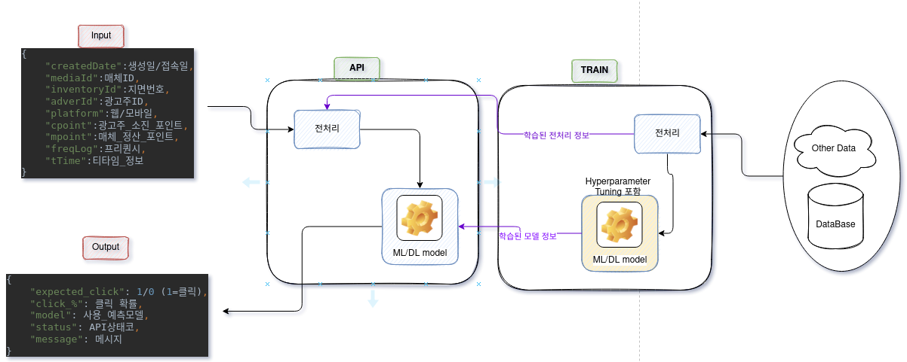

# CTRprediction

### Workflow



main.py 실행 하면
1. train.py 실행 : 저장된 데이터를 사용하여 전처리-모델 학습 하고 학습된 값을 저장해줍니다.
2. flask_api.py 실행 : 저장된 학습된 값을 가지고 API 서빙.

### Endpoint: /click_prediction

- expects **JSON** data format
- expects POST request

#### Input Property (To be added):

| Attribute | Description | Datatype |
| ------ | ------ |  ------- |
| createdDate | 생성일/접속일 | str |
| mediaId| 매체ID | str |
| inventoryId | 지면 아이디(지면번호) | int |
| adverId| 광고주 아이디 | str |
| platform | 웹/모바일 | str |
| cpoint| 광고주 소진 포인트 | float |
| mpoint| 매체 정산 포인트 | float |
| freqLog| 프리퀀시 | int |
| tTime| 티타임 정보 | int |

**Example input**

```
{
    "createdDate":"2021-11-07 10:00:18",
    "mediaId":"bangab",
    "inventoryId":585494,
    "adverId":"nutricore",
    "platform":"W", 
    "cpoint":0.0,
    "mpoint":0.0,
    "freqLog":29,
    "tTime":51
}
```

#### Output Property:

output도 Json format.

| Attribute | Description | Datatype |
| ------ | ------ |  ------- |
| expected_click | 예측 클릭(1)/no_클릭(0) | int |
| click_%| 클릭할 확률 | float |
| model| 예측 모델 | str |
| status| 요청 여부 | str |
| message| 요청 여부 메시지 | str |

**Example output**

```
{
    "expected_click": 0.0,
    "click_%": 5.93,
    "model": "xgboost_clf",
    "status": "00",
    "message": "success"
}
```

<br />

#### API Status Code:


| Code | Reason | Solution |
| ------ | ------ | ------ |
| 00 | POST 성공시 | .. |
| 01 | 모델관련 문제 | .. |
| 02| Input의 datatype 이 잘못됨 | 알맞는 datatype 을 사용하세요 |
| . | .. | .. |
| 20| ..| .. |

<br>

#### 파이썬 예제

```
import json
import requests

input_data = {
    "createdDate":"2021-11-07 10:00:18",
    "mediaId":"bangab",
    "inventoryId":585494,
    "adverId":"nutricore",
    "platform":"W", 
    "cpoint":0.0,
    "mpoint":0.0,
    "freqLog":29,
    "tTime":51
}
url_path = f"api_domain/{end_point}"

response = requests.post(url_path, json=input_data)
status_code = response.status_code
output = response.json()
```
